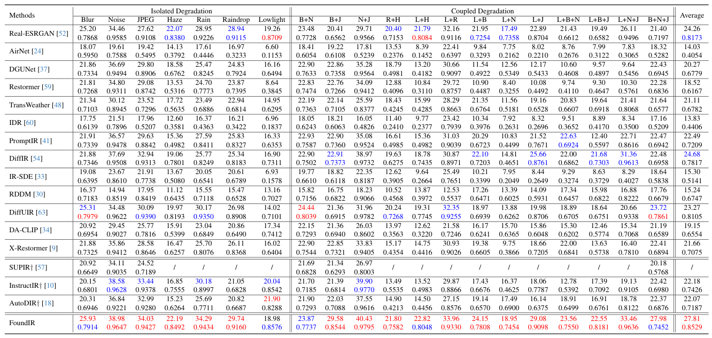

<p align="center">
  
</p>

### FoundIR: Unleashing Million-scale Training Data to Advance Foundation Models for Image Restoration
[](https://github.com/House-Leo/FoundIR)
> [[Project Page](https://www.foundir.net)]  &emsp; [[Paper](https://arxiv.org/abs/2412.01427)]

> [Hao Li*](https://house-leo.github.io/), [Xiang Chen*](https://cschenxiang.github.io/), [Jiangxin Dong](https://scholar.google.com/citations?user=ruebFVEAAAAJ&hl=zh-CN&oi=ao), [Jinhui Tang](https://scholar.google.com/citations?user=ByBLlEwAAAAJ&hl=zh-CN), [Jinshan Pan](https://jspan.github.io/) <br>
> [IMAG Lab](https://imag-njust.net/), Nanjing University of Science and Technology

<!-- --- -->
<!-- <p align="center">
  
</p> -->

<!-- *CFDVSR mainly consists of a propagation module with the discriminative alignment correction (DAC) and a collaborative feedback propagation (CFP) module. The DAC uses shallow features ft to explore more details information after feature warping, which corrects the aligned features for propagation.  The Feedback ConvGRU and gated collaborate feed-forward block (GCFB) in CFP bring more temporal interactions between different timestep featuresfrom forward and backward propagation simultaneously.* -->

---

### Coming soon.

### 🚩 **New Features/Updates**

- ✅ December 03, 2024. Release paper on [arXiv](https://arxiv.org/abs/2412.01427).
- ✅ November 22, 2024. Creat the repository and the [project page](https://www.foundir.net).

### ⚡ **To do**
- Release dataset
- Release testing code and pre-trained models


<!-- ### Results
- **Quantitative Results**


- **Qualitative Results**

 -->


<!-- ### Citation
If this work is helpful for your research, please consider citing the following BibTeX entry.
```

 ``` -->


### Contact
If you have any questions, please feel free to reach us out at <a href="mailto:haoli@njust.edu.cn">haoli@njust.edu.cn</a> and <a href="mailto:chenxiang@njust.edu.cn">chenxiang@njust.edu.cn</a>.
