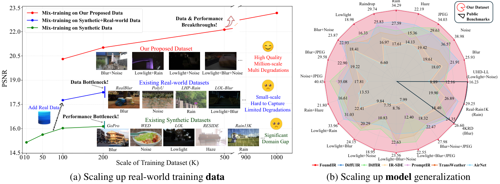
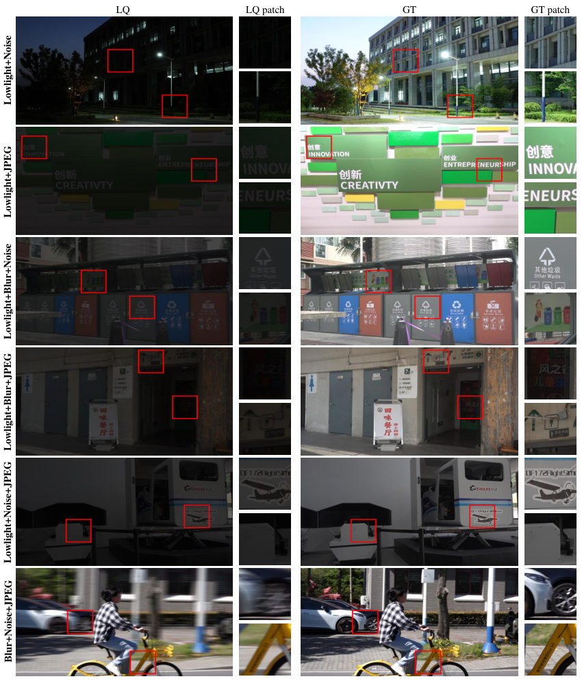

<p align="center">
  
</p>

### FoundIR: Unleashing Million-scale Training Data to Advance Foundation Models for Image Restoration
[](https://github.com/House-Leo/FoundIR)
> [[Project Page](https://www.foundir.net)]  &emsp; [[Paper](https://arxiv.org/abs/2412.01427)] &emsp; [[Supplemental Material](https://drive.google.com/file/d/11JTb6Dqd7RlV4kItOUwsNb43EyodVJYC/view?usp=sharing)] &emsp; [[中文版介绍](https://mp.weixin.qq.com/s/R_UP-hdRYS_2pKlh-Nr8JA)]

> [Hao Li*](https://house-leo.github.io/), [Xiang Chen*](https://cschenxiang.github.io/), [Jiangxin Dong](https://scholar.google.com/citations?user=ruebFVEAAAAJ&hl=zh-CN&oi=ao), [Jinhui Tang](https://scholar.google.com/citations?user=ByBLlEwAAAAJ&hl=zh-CN), [Jinshan Pan](https://jspan.github.io/) <br>
> [IMAG Lab](https://imag-njust.net/), Nanjing University of Science and Technology

---
<p align="center">
  
</p>

*The potential of large-scale training data for universal image restoration. (a) Analysis of universal image restoration performance in real-world scenarios as training data vary. As the size of real-world training data increases, the image restoration model can achieve significant performance improvement. (b) Our proposed FoundIR, trained on our million-scale dataset, achieves state-of-the-art performance across a broad range of image restoration tasks compared to existing universal image restoration methods.*

---

<!-- ### Coming soon. -->

### 🚩 **New Features/Updates**
- ✅ February 05, 2025. Release the testing code and [pre-trained model](https://github.com/House-Leo/FoundIR/releases/download/Premodel/model-2000.pt) of the generalist model, and the testset (LQ) on [Google Drive](https://drive.google.com/file/d/1wOaquAjnuzCh6Jv3CJz76mgnx4nfZgBY/view?usp=sharing).
- ✅ December 03, 2024. Release [paper](https://arxiv.org/abs/2412.01427) and [supplemental material](https://drive.google.com/file/d/11JTb6Dqd7RlV4kItOUwsNb43EyodVJYC/view?usp=sharing).
- ✅ November 22, 2024. Creat the repository and the [project page](https://www.foundir.net).

### ⚡ **To Do**
- Release training dataset
- Release testing code and pre-trained models of the specialist models

---

### How to evaluate

#### Environment
```
conda env create -f environment.yml
```

#### Testing
- Download the [pre-trained model](https://github.com/House-Leo/FoundIR/releases/download/Premodel/model-2000.pt) and put it in the `./premodel` folder.
- Put the testset in the `./dataset` folder.
- Run the following command to test the model on the testset (LQ).
```
bash test.sh
```

---
### Dataset


**More samples can be found in the [supplemental material](https://drive.google.com/file/d/11JTb6Dqd7RlV4kItOUwsNb43EyodVJYC/view?usp=sharing) (P7-P9).**

### Results
- **Quantitative Results**


- **Qualitative Results**


**More qualitative results can be found in the [supplemental material](https://drive.google.com/file/d/11JTb6Dqd7RlV4kItOUwsNb43EyodVJYC/view?usp=sharing) (P10-P37).**

### Citation
If this work is helpful for your research, please consider citing the following BibTeX entry.
```
@article{li2024foundir,
      title={FoundIR: Unleashing Million-scale Training Data to Advance Foundation Models for Image Restoration},
      author={Li, Hao and Chen, Xiang and Dong, Jiangxin and Tang, Jinhui and Pan, Jinshan},
      journal={arXiv preprint arXiv:2412.01427},
      year={2024}
}
 ```

### Acknowledgement
We would like to thank our team members (*Hao Chen, Yinghui Fang, Jiashuo Liu, Ke Wu, Renyuan Situ, ...*) for their contributions in data collection and post-processing of this work.

### Contact
If you have any questions, please feel free to reach us out at <a href="mailto:haoli@njust.edu.cn">haoli@njust.edu.cn</a> and <a href="mailto:chenxiang@njust.edu.cn">chenxiang@njust.edu.cn</a>.
